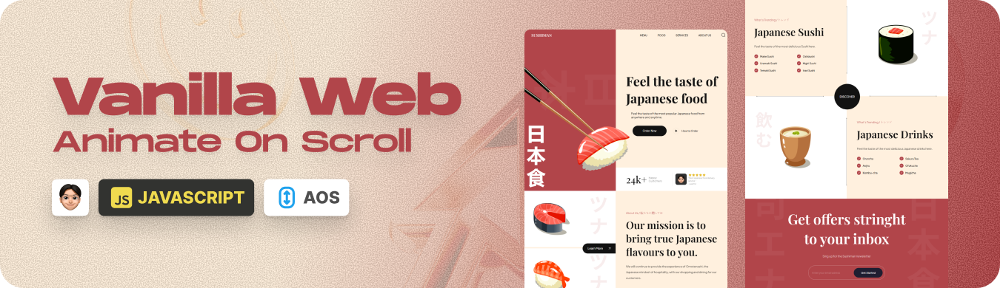
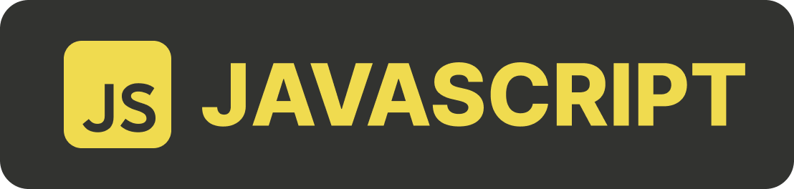
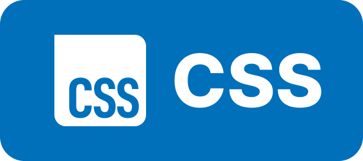
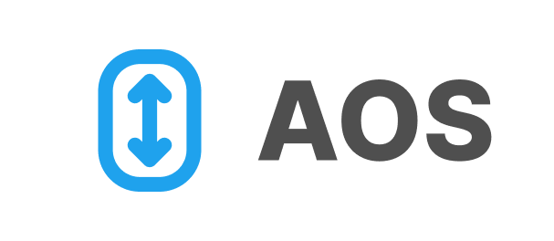

    
   

# 🎬 Movie App (React + Appwrite)

## 🧠 Description

This is a simple front-end project built with **Vanilla JavaScript, HTML, and CSS**, focused on creating **smooth scroll-based animation**s using the **AOS** (Animate On Scroll Library).

The goal of this project was to practice clean structure, lightweight interactions, and enhance user experience through subtle yet impactful animations triggered on scroll — without relying on heavy frameworks.

---

## 🌐 Live Site

👉 **Live demo:**  
🌐 [Link to Live Demo (Vercel) ↗](https://sushi-website-theta.vercel.app/)

---

## 👨‍💻 Author

**Juan Santillán**
| Front-End Developer and creative enthusiast.

---

## 🛠️ Technologies Used

> The following technologies were used in this project.

  
  
  
  

---

## ✨ Notes

- Scroll animations implemented with AOS.
- Built with pure JavaScript (no frameworks).
- Responsive layout using HTML and CSS.
